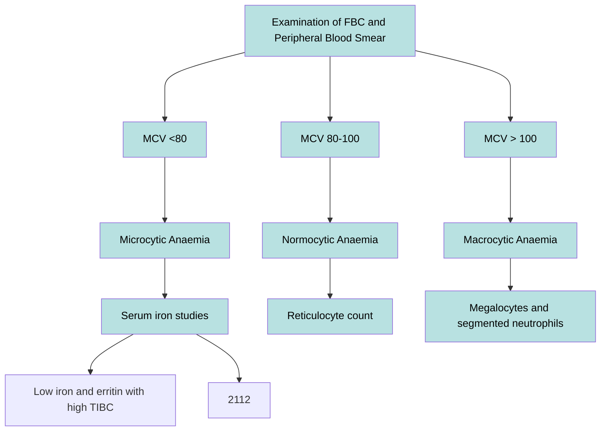

*Created on 9th May 2023*

---
```toc
```
---

# Information
 
Anaemia is a condition of low RBC and oxygen-carrying capacity which causes symptoms of faitgue and weakness.

![[Pasted image 20230509094418.png]] ^d5658c



## Pathophysiology
| [[Microcytic Anaemia]]<br>MCV < 80   | [[Normocytic Anaemia]]<br>MCV 80-100  | [[Macrocytic Anaemia]]<br>MCV > 100 |
| :-------------------------: | :-------------------------: | :-----------------------: |
| Iron deficiency           | Anemia of Chronic Disease |  Folate/B12 deficiency                       |
| THalassemia               | Hemolysis                 | Liver Disease           |
| Anemia of Chronic DIsease | Aplastic Aneia            | Alcohol use             |
| Sideroblastic ANemia      | Chronic Kidney Disease    | Reticulocytosis                        |
| Lead Poisoning            |                           |                         |
![[Pasted image 20230509100344.png]]

--- 
# Scenario

2/7 days of dyspnoea, eercise tolerance < 20m (decreased from at least 100m). No fever, no resp symptoms. Has intermittent diarrhoea for a few days --> septic and anaemic.


# History
## Signs
### *Symptoms*
Typically asymptomatic but symptoms include:
1. Weakness
2. Fatigue 
3. Dyspnoea
4. Palm crease pallour, nail bed palllour, conjunctival pallour 


---

## Examination findings
- Low BP
- Weak pulses
- Pallor of hands, face, conjunctiva, tongue
- Murke's lines on nails 
- Splenomegaly?

---

## Investigations

- FBC - Hb, WCC, ESR/CRP, platelets, MCV
- Coags study
- U & Es, LFTs
- Bun-Creating ratio - elevated in UGIB
- Stool MCS - infective cause e.g. C.diff
- FOBT / calprotectin --> CRC, IBD
- Upper endoscope or colonoscope for UGIB/LGIB
- NG aspirate - blood could indicate UGIB
- Eplorative laparotomy?

| Key Tests                                   | Result                                                                                                                  | Explanation                                                                                             |
| ------------------------------------------- | ----------------------------------------------------------------------------------------------------------------------- | ------------------------------------------------------------------------------------------------------- |
| Blood smear                                 | Hypochromia - iron deficiency                                                                                           |                                                                                                         |
| ^^                                          | Spherocytes - spherocytosis                                                                                             |                                                                                                         |
| ^^                                          | Target cells - thalassemia                                                                                              | Due to hypochromic microcytic RBCs                                                                      |
| ^^                                          | Dacrocytes (tear drop cellls) - marrow fibrosis                                                                         |                                                                                                         |
| ^^                                          | Acanthocytes (spiked RBCs) - liver disease                                                                              |                                                                                                         |
| ^^                                            | Schistocytes - haemolysis                                                                                               |                                                                                                         |
| Low reticulocyte count                      | Helpful for normocytic anaemia - anaemia of chronic disease, CKD, hypothyroidism, bone marrow failure, aplastic anaemia | Otherwise usually, reticulocyte count will be high as the body produces more EPO to counter the anaemia |
| Pancytopenia (FBC)                          | Low platelets, RBC, WBC                                                                                                 | Indiciates aplastic anaemia and can be caused by bone cancers/fibrosis                                  |
| MCV (FBC)                                   | Micro: <80<br>Normo: 80-100<br>Macro: >100                                                                              | Changed potential cause. See below for algorith                                                         |
| High transferrin in iron-deficiency anaemia |                                                                                                                         | Body is trying to sequester more iron from stores                                                       |
| Low transferrin in ACD                      |                                                                                                                         | Body is not sequestering iron from stores                                                               |

![[Anaemia#^d5658c]]


---

# Management
## Initial Acute Management
1. ABCDE
2. 2 large bore IV - fluids or blood
3. G + H
4. IV PPI (if unsure of cause / UGIB suspected)
5. Monitor Hb and Coags panel
6. Treatment based on cause 
7. Surgery if haemodynamically unstable / severe intitial/ongoing bleeding


## Longer term Mx
1. Monitor Hb and coags
2. Reduce risk of recurrent bleeds e.g. nitrates
3. Oral PPI if PUD, GORD, H.pylori
4. Iron supplements
5. Folate / B12 supplements 


---
